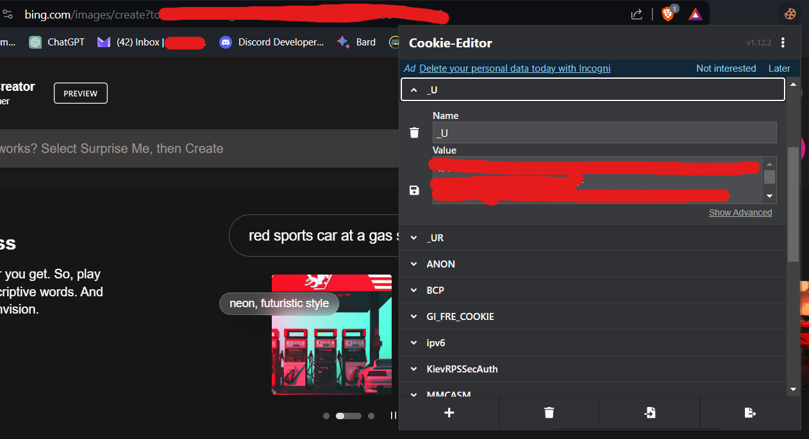

# Script in python to generate AI images using bing

## How it works
Using only 2 user cookies, you can generate images with 3 models:
* MAI-2.5-flash
* Dalle-3
* GPT-4o

Also accepts image for image->image generation
## Installation
[python](https://www.python.org/downloads/) (I used 3.10.9)


in cmd

```bash
git clone https://github.com/Hecker5556/bingaigenerate
```
```bash
cd bingaigenerate
```
```bash
pip install -r requirements.txt
```

## Usage

```bash
usage: binggenerate.py [-h] [--model {MAI,GPT-4o,Dalle-3}] [--aspect-ratio {3:2,1:1,4:7,7:4,2:3}] [--verbose] [--file FILE] query

positional arguments:
  query                 query

options:
  -h, --help            show this help message and exit
  --model {MAI,GPT-4o,Dalle-3}, -m {MAI,GPT-4o,Dalle-3}
                        Model to use
  --aspect-ratio {3:2,1:1,4:7,7:4,2:3}, -a {3:2,1:1,4:7,7:4,2:3}
                        Aspect ratio of images
  --verbose, -v         enable verbosity
  --file FILE, -f FILE  Provide path to file for image->image generation
```
## Python usage

```python
import asyncio
from binggenerate import binggenerate
_U = "your _U cookie"
_EDGE_S = "your _EDGE_S cookie"
query = "astronaut in the ocean"
async def main():
  async with binggenerate(_U, _EDGE_S) as bing:
    result = await bing.generate(query, "GPT-4o", "1:1")
    filenames = result.get("filenames")
asyncio.run(main())
```

## Authentication

Luckily there are only two cookies needed to authenticate your requests, and that's the _U cookie and the _EDGE_S, which you can get from using a cookie viewing extension. _U is mandatory, _EDGE_S only if doing image->image generation.



_U is a temporary cookie which means you need to periodically update it.

## Extra info about bing

- Bing allows at most 3 concurrent image generating processes
- There are many blacklisted prompts, such as famous people and religious stuff (not always)
- Sometimes bing will assume a result is bad, and theres nothing you can really do except change the prompt and experiment